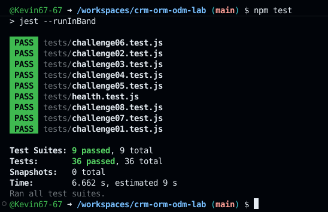

# CRM ORM/ODM Lab

API REST de un CRM básico que combina un ORM (Sequelize + PostgreSQL) y un ODM (Mongoose + MongoDB).

## Stack

- Node.js 22, Express 5, CommonJS
- Sequelize + PostgreSQL 16 (`User`, `Company`, `Contact`)
- Mongoose + MongoDB 7 (`Activity`)
- Jest + Supertest
- GitHub Codespaces, Dev Containers, Docker Compose
- Supervisor (`npm run dev`)

## Arquitectura

```text
GitHub Codespace
│
├── app       Node.js 22  ──┬── Sequelize ──> postgres (PostgreSQL)
│                           └── Mongoose  ──> mongo    (MongoDB)
├── postgres
└── mongo
```

La aplicación se conecta por nombre de servicio (`postgres`, `mongo`). Las credenciales de desarrollo llegan como variables de entorno definidas en `.devcontainer/docker-compose.yml` (ver `.env.example`).

## Iniciar el Codespace

1. En GitHub: **Code → Codespaces → Create codespace on main**.
2. Espera a que se levanten los tres servicios (`app`, `postgres`, `mongo`). `postCreateCommand` ejecuta `npm install`.

## Instalar dependencias

```bash
npm install
```

## Seed y reset

```bash
npm run seed    # inserta datos deterministas (3 users, 4 companies, 8 contacts, 10 activities)
npm run reset   # elimina y recrea tablas/base de datos y vuelve a sembrar
```

## Iniciar la API

```bash
npm start       # node ./bin/www
npm run dev     # supervisor ./bin/www
```

Servidor en el puerto `3000` (variable `PORT`).

## Pruebas

```bash
npm test
```

Cada suite restablece PostgreSQL y MongoDB antes de ejecutarse y cierra las conexiones al terminar.

## Endpoints

| Método | Ruta | Descripción |
|---|---|---|
| GET | `/health` | Health check |
| GET | `/users` | Listar usuarios |
| GET | `/users/:id` | Obtener usuario |
| POST | `/users` | Crear usuario |
| PUT | `/users/:id` | Actualizar usuario |
| DELETE | `/users/:id` | Eliminar usuario |
| GET | `/companies` | Listar compañías (`?industry=`) |
| GET | `/companies/:id` | Obtener compañía |
| POST | `/companies` | Crear compañía |
| PUT | `/companies/:id` | Actualizar compañía |
| DELETE | `/companies/:id` | Eliminar compañía |
| GET | `/contacts` | Listar contactos |
| GET | `/contacts/:id` | Obtener contacto |
| POST | `/contacts` | Crear contacto |
| PUT | `/contacts/:id` | Actualizar contacto |
| DELETE | `/contacts/:id` | Eliminar contacto |
| GET | `/activities` | Listar actividades (`?type=`) |
| GET | `/activities/:id` | Obtener actividad |
| POST | `/activities` | Crear actividad |
| PUT | `/activities/:id` | Actualizar actividad |
| DELETE | `/activities/:id` | Eliminar actividad |

Los errores se devuelven como JSON: `{ "error": "Contact not found" }`.

## Respuestas
**1. Dos motores.**
Activity es un buen candidato para MongoDB ya que sus actividades pueden tener información diferente, eso depende de si son llamadas, correos o reuniones, más que nada en metadata.
Mientras que Company y Contact funcionan mejor en PostgreSQL, ya que se cuenta con una relación definida entre ellos y es necesario mantener datos estructurados y relacionados.


**2. ORM vs ODM.**
Un ORM nos permite trabajar con bases de datos relacionales a través de objetos, por otro lado, ODM hace algo parecido con documentos.
El proyecto usa Sequelize como ORM para PostreSQL y Mongoose como ODM para MongoDB, y su diferencia principal radica en que Sequelize maneja tablas y relaciones, mientras que Mongoose trabaja con documentos y esquemas que se pueden considerar mas flexibles.


**3. Configuración por variables de entorno.**
Las variables de entorno se pueden encontrar en .devcontainer/docker-compose.yml.
PostgreSQL usa DB_HOST: postgres, MongoDB usa MONGODB_URI: mongodb://mongo:27017/crm.
No usa localhost porque la app y las bases de datos se encuentran en contenedores diferentes y se comunican usando los nombres de los servicios.
Además si se escribieran las credenciales directamente en archivos .js estas mismas quedarían expuestas en el código.


**4. Asociaciones.**
Dentro de models/sequelize/index.js, Company tiene una relacion de muchos a muchos con Contact, la llave foránea es companyId y se ubica en Contact, el alias contacts nos permite identificar la asociación y usarla.


**5. Eager loading.**
Si primero obtenemos la compañía y después los contactos, se necesitarían dos consultas por separado, si usamos include en getById en controllers/companies.js, Sequelize puede obtener la compañía junto a sus contactos atraves de la asociación, así se simplifica el código y ahorramos hacer una consulta adicional desde el controlador.


**6. Instancia vs consulta.**
En update dentro de controllers/contacts.js primero se obtiene el contacto con findByPk() y luego se nodifica la instancia con contact.update(), así se tiene el objeto actualizado directamente y comprobar antes si es que existe.
Model.update() modifica registros usando where, pero generalmente devuelve información sobre la cantidad de registros afectados y no necesariamente la instancia de la misma forma.


**7. Esquema flexible.**
Dentro de models/mongoose/activity.js, metadata usa mongoose.Schema.Types.Mixed, permitiendo guardar objetos con estructuras distintas para CALL, EMAIL y MEETING, una desventaja podría ser que Mongoose cuenta con menos control de la estructura y tipos de los datos almacenados dentro del campo.

**8. Sin ref.**
contactId y userId son números que corresponden a registros que se encuentran almacenados en PostgreSQL, no documentos de MongoDB, es por eso que Mongoose no puede usar ref y populate con ellos. La consecuencia es que MongoDB no puede garantizar automáticamente que esos id's sigan existiendo si se elimina un User o Contact en PostgreSQL.

**9. Documento actualizado.**
Antes de corregir update de controllers/activities.js, findByIdAndUpdate() devolvía el documetno anterior a su modificación. La implementación de la opción new: true hace que reciba el documetno actualizado y runValidators: true, valida los nuevos datos usando el esquema de Activity.

**10. Pruebas de comportamiento.**
Probando el comportamiento podemos verificar que la API arroje el resultado esperado sin depender de una implementeacion específica, de este modo, se puede cambiar la manera interna de resolver un reto, siempre y cuando el endpoint responda correctamente.

**11. Repetibilidad.**
Dentro de tests/setup.js, antes de cada suite, se conectan a PostreSQL y MongoDB, reestableciondo los datos con reset(), y al terminar se cierran las dos conexiones. De esta manera se puede que cada suit comience con los mismos datos y que los resultados de npm test sean repetibles.


**12. Mi experiencia.**
Personalmente el reto 06 fue el que más dificultades me presentó, porque la actividad en sí, sí se creaba, pero metadata no se estaba guardando de manera correcta, entonces con ayuda de las pruebas Jest pude darme cuenta que ese campo llegaba vacío, y al revisar create en controllers/activities.js, me di cuenta que faltaba incluir metadata al tomar los datosa de req.body y al crear la actividad.


## Evidencia
